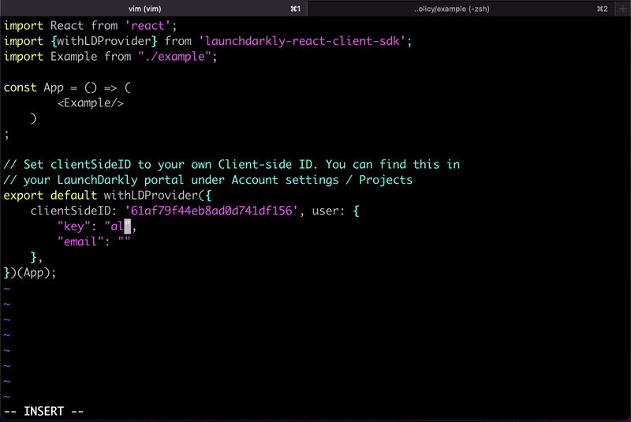

 

<h1 align="center">
🎚️ OPToggles 🎚️
</h1>

<h2 align="center">
Open policy based feature toggling
</h2>

# What is OPToggles?

We often want our frontend to reflect the permissions enforced by the backend. E.g. if a user is not allowed to click run the action behind a button - don't show them that button.

`OPToggles` brings the power of <a href="https://github.com/permitio/opal" target="_blank">`OPA` + `OPAL`</a> into your existing feature toggling solutions.  
It enables you to create user targeted feature flags/toggles based on <a href="https://openpolicyagent.org" target="_blank">Open Policy</a> managed authorization rules, and keep them
synced thanks to `OPAL`'s realtime policy and policy-data change detection. 
 
With OPToggles frontend devs can continue to enjoy working with the feature flags they are familar with, and backend-devs easily harness the power of open-policy.

 

# Documentation

- ⚡️ &nbsp; [Quick Start Guide](docs/quickstart.md)
- 🤿 &nbsp; [How Does It Work](docs/howitworks.md)
- 🦮 &nbsp; [First OPToggle Walkthrough](docs/walkthrough.md)
- 📓 &nbsp; [Configuration File Reference](docs/configuration.md)
- 📖 &nbsp; [For further reading check out our Blog](https://bit.ly/permitioblog).

# 👥 Community & Contribution

**Come talk to us about OPToggles, or authorization in general - we would love to hear from you ❤️**

You can raise questions and ask for features to be added to the road-map in our [**Github discussions**](https://github.com/permitio/OPToggles/discussions), report issues in [**Github issues**](https://github.com/permitio/OPToggles/issues), follow us on Twitter to get the latest OPToggles updates, and join our Slack community to chat about authorization, open-source, realtime communication, tech any anything else!
 
 
If you are using our project, please consider giving us a ⭐️
 
 

[![Button][join-slack-link]][badge-slack-link]   [![Button][follow-twitter-link]][badge-twitter-link]

## Contributing to OPToggles

- Pull requests are welcome! (please make sure to include _passing_ tests and docs)
- Prior to submitting a PR - open an issue on GitHub, or make sure your PR addresses an existing issue well.

[join-slack-link]: https://i.ibb.co/wzrGHQL/Group-749.png
[badge-slack-link]: https://bit.ly/permitioslack
[follow-twitter-link]: https://i.ibb.co/YZwWJm7/Group-751.png
[badge-twitter-link]: https://twitter.com/opal_ac
