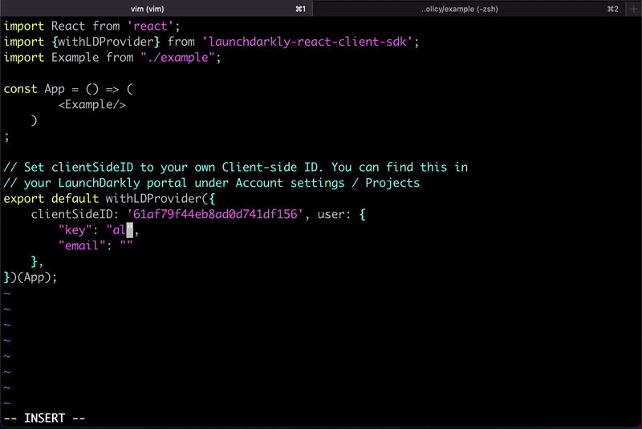

## Sync Open-Policy to your Frontend

When developing a new feature, often we seek to control which users can access and interact.  
For example, we want to make sure only subscribers can access paid features.  
If the user has no permissions, we decide whether we show the feature disabled or hide the feature altogether.  
We enforce a policy that states: which [user] can perform [actions] on [resource].

OPToggles (Open Policy Toggles) is an open-source project that brings the power of `OPA` and `OPAL` into your frontend through existing feature flagging solutions.  
OPToggles automatically creates user-targeted feature flags based on your existing authorization rules, pushes them to the feature flag solution, and keeps them synced thanks to OPAL's real-time policy and policy-data event-driven architecture.

- OPToggles uses `OPA` as the source of truth for what policy is true for the user.
- OPToggles uses `OPAL` to get real-time policy/data updates.

With OPToggles, frontend devs can continue to enjoy working with the feature flags solutions they already use.
There’s a one-time effort for backend developers configuring OPToggles to connect to OPA and OPAL, and all the rest is automatic.

Currently, OPToggles works with [LaunchDarkly](https://www.launchdarkly.com) and with a Generic REST API.
[Let us know](https://bitly.com/permit-slack) if you'd like to see OPToggles integrated with other feature flag solutions, or better yet contribute one with a pull request on [OPToggles' Github](https://github.com/permitio/OPToggles).

OPToggles is part of [Permit’s](https://www.permit.io) suite of open source solutions.

In the GIF, you can see how we

- Add the admin role to Alice.
- Commit the new policy.
- Alice can immediately see "Flag On", without any code changes.

## Get Started with OPToggles

- Setup OPA and OPAL
- Config OPTpggles to receive callbacks from OPAL client
- Configure OPToggles to the relevant feature flag solution API
- Build and Run OPToggles

## OPToggles Support and Help

We are always eager to talk to fellow developers, and we'd be happy to help with anything regarding OPToggles, OPA and OPAL, Permit.io, and IAM in general.

### 👩‍💻 Github

We use Github to manage support tickets, ongoing design discussions, and product roadmap.

You're welcome to join the conversation and open **issues (bug reports, feature requests)** and **discussions (general questions / thoughts)** across our suite of products:

- [Permit.io](https://github.com/permitio)
- [OPAL](https://github.com/permitio/opal)
- [OPToggles](https://github.com/permitio/OPToggles)

### 📧 Email and Zoom

Got a more specific question? You can reach out to us via classic email at [support@permit.io](mailto:support@permit.io).
Want to dive deeper with our team? You can even [schedule a Zoom call with us](https://calendly.com/permitio/meeting).
