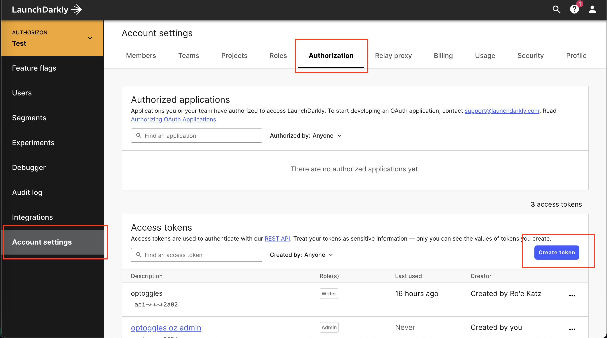
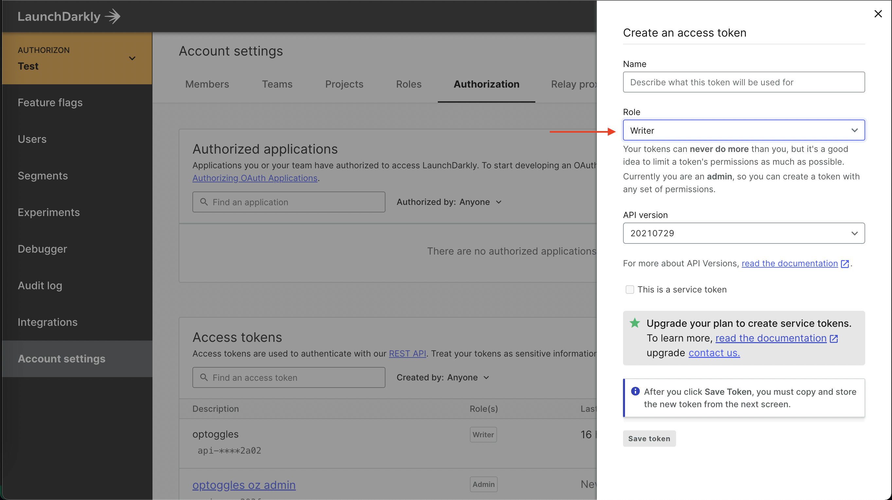

Let's walk you through setting up your first open policy based feature toggles, integrated with `LaunchDarkly`!

The demo code and example files available [here](https://github.com/permitio/OPToggles/tree/master/example).

## Step 1 - preparation

In the prepataion step, we are creating a user-targeted policy that we need for OPToggle.
We're going to create user data and policy files, and declare them in a manifest file.

### Exmaple data
You can clone our `data.json` [example policy repo](https://github.com/permitio/opal-example-policy-repo/blob/master/data.json). 

In our example data.json you can find:
* Three users: Alice, Bob, and Eve.
* The three of them are US users with the same IP.
* Each user have a different role (i.e. bob is a billing user).
* Each role have different permissions (i.e. finance role can read and update "finance").

```
{
  "users": {
    "alice": {
      "roles": ["admin"],
      "location": {
        "country": "US",
        "ip": "8.8.8.8"
      }
    },
    "bob": {
      "roles": ["employee", "billing"],
      "location": {
        "country": "US",
        "ip": "8.8.8.8"
      }
    },
    "eve": {
      "roles": ["customer"],
      "location": {
        "country": "US",
        "ip": "8.8.8.8"
      }
    }
  },
  "role_permissions": {
    "customer": [
      {
        "action": "read",
        "type": "dog"
      },
      {
        "action": "read",
        "type": "cat"
      },
      {
        "action": "adopt",
        "type": "dog"
      },
      {
        "action": "adopt",
        "type": "cat"
      }
    ],
    "employee": [
      {
        "action": "read",
        "type": "dog"
      },
      {
        "action": "read",
        "type": "cat"
      },
      {
        "action": "update",
        "type": "dog"
      },
      {
        "action": "update",
        "type": "cat"
      }
    ],
    "billing": [
      {
        "action": "read",
        "type": "finance"
      },
      {
        "action": "update",
        "type": "finance"
      }
    ]
  }
}
```

### Example policy

OPA uses Rego code a high-level declarative language. 
Rego can be used to write any type of rule, including simple and complex rules with loop, function calls, and more.
For our example, let's create a new `features.rego` file with the following rules.
The Rego code is based on the structure of the data.json file we created in the previous step:

```rego
package app.rbac

billing_users[users] {
  some user, i
  data.example.users[user].roles[i] == "billing"
  users := user
}

us_users[users] {
  some user
  data.example.users[user].location.country == "US"
  users := user
}
```

Let's go over the Rego code quickly:
- We declare two sets of users: `billing_users` and `us_users`.
  - `billing_users` holds a set of all users that their role is "billing".
  - `us_users` holds a set of all users that their country is "US".
- We use the "data." prefix to reach the data.json content.

Our example data.json code have bob as a billing user and alice, bob, and eve as US users.
You can follow [this link](https://play.openpolicyagent.org/p/kHY8OnxUQq) to test the Rego part of the demo separately.

### Manifest file
Create a `.manifest` file listing the policy and data files paths.
You can copy our [example](https://github.com/permitio/OPToggles/blob/master/example/.manifest).


## Step 2 - Setup OPAL and OPA

We'll use `docker-compose` for setting up `OPAL` and `OPA`.

We're going to need an `OPA` instance, managed by `OPAL` for realtime policy and policy data
updates. Our starting point would be one of `OPAL`'s
example [docker-compose configurations](https://github.com/permitio/opal/blob/master/docker/docker-compose-example.yml)
.<br/>
To learn more about working with `OPAL` container images
view [this guide](https://github.com/permitio/opal/blob/master/docs/HOWTO/get_started_with_opal_using_docker.md))

We want to feed `OPA` with that data & policies, for that - we'll use `OPAL`'
s [git-tracking capabilities](https://github.com/permitio/opal/blob/master/docs/HOWTO/track_a_git_repo.md):

Edit our `docker-compose.yaml` to configure `OPAL Server` to track the right git repo, branch & `.manifest` file:

```yaml
  opal_server:
    environment:
      - OPAL_POLICY_REPO_URL = https://github.com/permitio/OPToggles
      - OPAL_POLICY_REPO_MAIN_BRANCH = master
      - OPAL_POLICY_REPO_MANIFEST_PATH = example/.manifest
      - OPAL_POLICY_REPO_POLLING_INTERVAL = 30
```

Once updating docker-composer yaml file, you can already use `OPAL` with your backend to authorize requests using realtime data, and deny users forbidden actions.

But getting an `401 Unauthorized` (or another error message, as elegant as it might be) in the client side isn't exactly
an UX best practice :)

## Step 3 - Setup LaunchDarkly

That's where the magic of feature management platforms enters: `LaunchDarkly` enables you to manage feature toggles
across multiple projects and deployment environments, and it has rich client-side sdk support, already used by many
developers to turn UI features on & off.

If you don't already have a `LaunchDarkly` account, create it [here](https://app.launchdarkly.com/signup).

Next thing you would need is a `project` and one or more `environment`. You can manage those under `Account settings`
-> `Projects`.

Each `LaunchDarkly` account can contain multiple projects for different products. I this example we're going to use the
pre-existing `default` project. 

Your feature toggles can have configurations for different deployment environments.
In our example - we use the two pre-defined environments: `production` & `test`.

LaunchDarkly project settings should look like that:


From now on - OPToggles would take care of toggle creation and updates thorugh `LaunchDarkly` for us. <br/>
**In order to use OPToggle you need an API key, that is available for Professional plans or higher at
the moment. <br/>**
You can create a token under `Account settings` -> `Authorization`, or
using [this link](https://app.launchdarkly.com/settings/authorization/tokens/new). <br/>


`OPToggles` requires your token to have `Writer` permissions at minimum.




Don't loose the generated token! We're gonna need it soon.

## Step 4 - Setup OPToggles

Now let's bring everything together using `OPToggles`. Our configuration yaml
is [here](https://github.com/permitio/OPToggles/blob/master/example/launchdarkly-config.yaml).

The configuration is divided to 3 sections - sources, target, and toggles.

### config Sources

```yaml
sources:
  - id: example-opal
    url: http://opal_client:7000
    token: ""
    advertisedAddress: optoggles:8080
```

- You can have multiple sources, each should have its unique id. 
- In the toggles section, we are refering to the source id under the 'source' field.
- Since we're running everything in docker-compose, we simply use the service names as hostnames (`opal_client`
   , `optoggles`)
- If your `OPAL Client` runs in secure mode, supply a JWT authentication token under the "token" field. Otherwise, leave token empty.

### Config Target 

```yaml
  targetType: launchdarkly
  targetSpec:
    # Replace with your generated api token
    launchdarklyToken: "api-xxxxxxxx-xxxx-xxxx-xxxx-xxxxxxxxxxxx"
```
OPToggle supports two targets at the moment, LaunchDarkly and a generic Rest API.
Read the [configuration guide](configuration.md) to see where to find the API key in LaunchDarkly.

### Config toggles

```yaml
toggles:
  - key: "us-feature"
    usersPolicy:
      source: example-opal
      package: "app.rbac"
      rule: "us_users"
    spec:
      name: "US Only Feature"
      projKey: "default"
      environments: [ "production", "test" ]
  - key: "billing-feature"
    usersPolicy:
      source: example-opal
      package: "app.rbac"
      rule: "billing_users"
    spec:
      name: "Billing Feature"
      projKey: "default"
      environments: [ "test" ]
```

- Each toggle's `usersPolicy` defines the `OPA` source.
- the source must match the names from the `features.rego` file.

### Add OPToggles

Now we can add the `OPToggles` as a service to
our [docker-compose](https://github.com/permitio/OPToggles/blob/master/example/docker-compose.yaml):

```yaml
  optoggles:
    image: permitio/optoggles:latest
    depends_on:
      - opal_client
    restart: on-failure
    volumes:
      - $PWD/launchdarkly-config.yaml:/etc/optoggles/config.yaml
```

Setting `restart` to `on-failure` is useful for errors on `OPToggles` initiation when rest of the containers are not
fully started.

Now that we have everything in place - let's bring it up!

```shell
docker-compose up -d
```

View our [configuration guide](configuration.md) for full understanding of its format.

## Step 5 - Demo time!

If everything went well, you should see the newly created flags in your `LaunchDarkly` account:


Let's update bob's location to another country:

```shell
opal-client publish-data-update --src-url https://api.country.is/23.54.6.78 -t policy_data --dst-path /users/bob/locationgit:master*
```

And our "US Only Feature" should be immediately updated to exclude "bob"!


You can integrate these new toggles into your client-side code like you would with any other `LaunchDarkly` flag. If
that's your first time - https://docs.launchdarkly.com/sdk/client-side.

One last important note: the created toggles are managed by `OPToggles`.
Trying to make manual changes to them makes no sense as they would get overridden by `OPToggles`.
