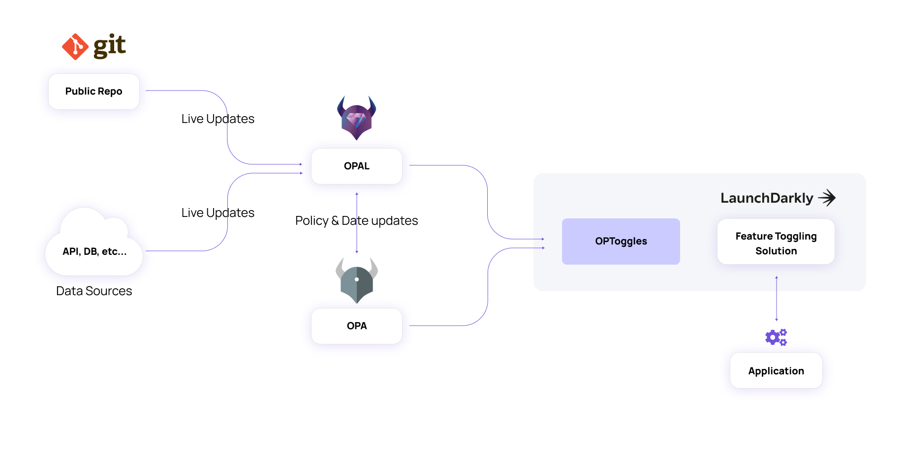

## OPA + OPAL Integration

OPToggles uses `OPA` to determine what users are authorized for each feature toggle.

`OPAL` is used in order to get live policy/data updates - Keeping your feature toggles always up to date.

On startup - `OPToggles` queries the configured `OPAL Client` - ([configuration guide](configuration.md))
for the address of the `OPA` instance it manages.

`OPToggles` then registers with the `OPAL Client` requesting an update callback. `OPAL` makes an HTTP
request to `OPToggles` on any update to policy or policy data.

The update callback triggers a sync process that would query `OPA` for the current user sets authorized for each feature
toggle. If `OPA` is unavailable, the query would be retried indefinitely with exponential sleep intervals (maxing out at
16 secs).

## Toggle Targets

The toggle targets are the feature management instances to which `OPToggles` syncs its configured toggles with their
current authorized users lists.

`OPToggles` currently supports 2 target types: LaunchDarkly and a Generic REST API target.

[Let us know](https://bit.ly/permitioslack) if you're interested in other targets.

On startup `OPToggles` creates the toggles, or just updates their metadata if they're already created. Do not manage
your toggles manually - as your changes would be overridden by `OPToggles`.

On each sync process the target would be updated with the current authorized users for each toggle. On failure,
auto retry will apply indefinitely with exponential sleep intervals (maxing out at 16 secs).

For detailed information on configuring each target type see our [configuration guide](configuration.md).

### LaunchDarkly

[LaunchDarkly](https://launchdarkly.com/) is a popular feature management platform, with available SDKs for a wide range
of languages and client side technologies.

Each OpToggle is mapped to a "Feature Flag" in LaunchDarkly. Feature Flags can have different values across different
environments. You can set the environments you want to be synced in the `OPToggles` configuration.

For each of the set environments of the feature flag, `OPToggles` would turn on "Targeting" mode; with `False` as the
default value, and `True` as the value for each of the authorized (thus targeted) users (queried from `OPA`).

**Integrating `OPToggles` with your LaunchDarkly account reqires the Professional plan at minimum** (where API access is allowed).

### Generic REST API

This target type should enable you to integrate with your own custom feature management system.

To create the toggles, `OPToggles` would make a `POST` request to the configured URL. The request's body is a json
representation of the toggle object which contains:

- A `key` field with the configured identifier of the toggle.
- Other user defined fields (supplied as "key: value" pairs under the toggle's spec)

To update the toggles with the latest authorized users list, `OPToggles` would make a `PATCH` request to "
{configured-url}/{toggle-key}", containing a new value for the `users` field of the toggle.

You can also set user defined HTTP headers that would be added for each REST API call to your target (e.g.
authorization).
